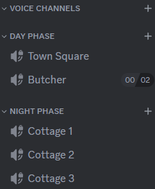
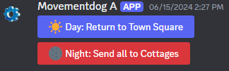
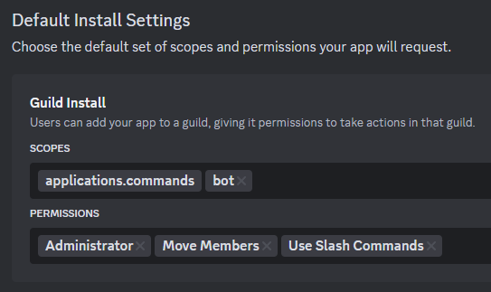
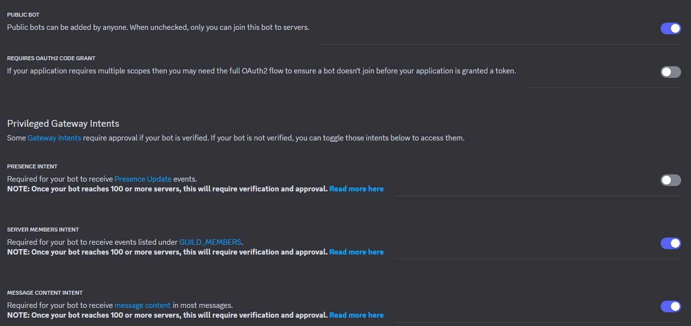

# Blood on the Clocktower Discord Bot

Simple self-hosted Discord bot to facilitate moving players to the Townsquare and to their private night cottages.

# Discord Server settings

You need 2 voice channel categories, one for the day phase, and one for the night phase. The night phase cottages should be marked as private so nobody besides the story teller can see them.

You also need a story teller role on your server. Only users with this role can control the bot.



Use the `/buttons` command to get the movement buttons. These buttons will persist, so there is typically no need to re-run the slash command.



# Setting up your own Discord Bot

Create a new Discord Bot [here](https://discord.com/developers) and add it to your server.





# Running the Bot

```golang
go run . -config="/path/to/.config.json"
```

The config can also be specified via environment variables. See `config.go` for more information.
